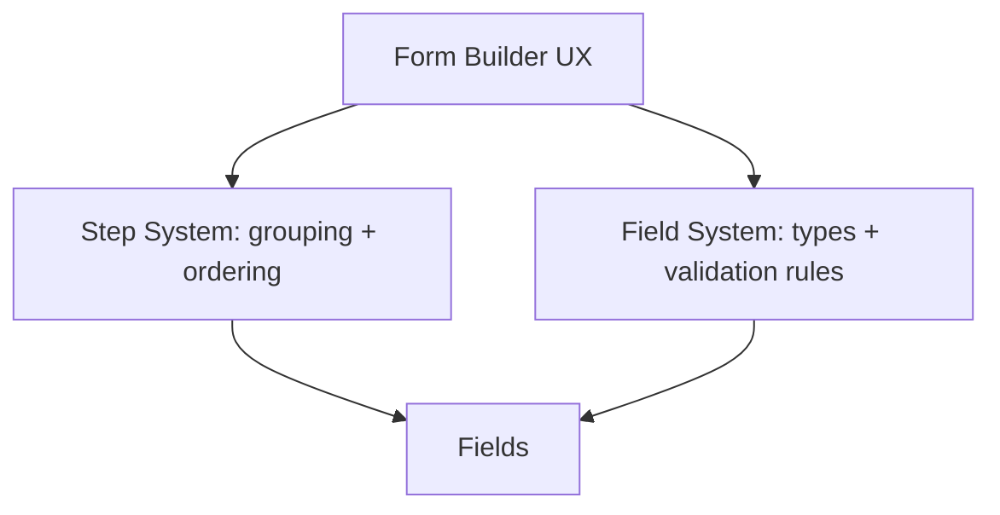

# Form Builder + Multistep System — Engineering Spec

Structured as a layered spec: **Product capability → UX / Interaction model → Technical implementation**. Engineers can derive work items; designers can reason about UX states.

---

# 1. Product Capabilities

Three capabilities are being introduced. They are **orthogonal systems**.

| Capability | Description |
| ---------- | ----------- |
| **Improved Form Builder UX** | Cleaner creation flow, grouped field picker, preview |
| **Multistep Forms** | Forms can be split into sequential sections (steps) |
| **Expanded Field Types** | Dedicated inputs (phone, date, number, dropdown, etc.) instead of overusing text |

Relationship:

- **Form Builder UX** edits both the **Field System** and the **Step System**.
- **Steps** group **fields**; **fields** define inputs.
- Builder UI edits steps and fields; respondent sees steps (if any) and fields.



---

# 2. Data Model

This is the critical section. The model uses **field.stepId + field.stepOrder** so that each field belongs to one step and has an explicit order within that step. Steps do not hold a list of field names; the reference is on the field.

## 2.1 Form

```ts
interface Form {
  id: string
  title: string
  description?: string
  kind: 'form' | 'poll' | 'survey'
  showResultsPublic: boolean
  fields: FeedbackField[]
  steps: FormStep[]
}
```

## 2.2 Step

```ts
interface FormStep {
  id: string           // stable client UUID
  title: string
  description?: string
  order: number        // unique per form, used for rendering sequence
}
```

## 2.3 Field

```ts
interface FeedbackField {
  name: string
  label: string
  type: FieldType      // new enum (see 2.5)
  required: boolean
  placeholder?: string
  options?: string[]   // checkbox | radio | dropdown
  allowAnonymous?: boolean
  stepId?: string      // null/undefined → implicit step 0 (single-step compat)
  stepOrder?: number   // position within the step
  validation?: FieldValidationRules
}

interface FieldValidationRules {
  min?: number         // number, date-as-ts
  max?: number
  pattern?: string     // regex for phone/url
  countryCode?: boolean
}
```

**Why stepId on the field**

- Simpler validation: every `field.stepId` must match a `step.id` (or be undefined for single-step).
- No broken references when renaming fields.
- Drag-and-drop: change `stepId` and `stepOrder`; no need to sync a separate list on the step.

Mental model: **Step → Fields** (step contains fields), not **Fields ↔ Step mapping**.

## 2.4 Field type full rename

Legacy types are renamed to a consistent taxonomy. New types are added.

| Old (legacy) | New |
| ------------ | --- |
| `short_text`, `long_text` | `text` |
| `big_text` | `textarea` |
| `name` | `text` (semantic “name” is label only; `allowAnonymous` unchanged) |
| `email` | `email` |
| `scale_1_10` | `scale` |
| `rating` | `rating` |
| `checkbox` | `checkbox` |
| `radio` | `radio` |
| `image_upload` | `image` |
| — | `phone` (new) |
| — | `date` (new) |
| — | `time` (new) |
| — | `number` (new) |
| — | `dropdown` (new) |
| — | `url` (new) |

## 2.5 Backend enum

In `backend/src/models/FeedbackForm.ts`:

```ts
const FEEDBACK_FIELD_TYPES = [
  'text', 'textarea', 'email', 'phone', 'number',
  'date', 'time', 'url', 'checkbox', 'radio', 'dropdown',
  'scale', 'rating', 'image'
]
```

## 2.6 Migration path

- **Script**: One-time migration over `FeedbackForm` collection. For each document, for each field in `fields[]`, map old `type` to new (e.g. `short_text` → `text`, `big_text` → `textarea`). Add `stepId` / `stepOrder` if steps are introduced later (e.g. all existing fields get a single default step).
- **Backend route**: On create/update, accept only new type values. If an old value is received, return 400 with a clear message (e.g. “Legacy field type X is no longer supported; run migration.”).
- **Submissions**: Respondent submission payloads store values only, not field types. No migration of submission data.

---

# 3. UX / Interaction Model

## 3.1 Builder layout

Single-page builder with **three panels**. No wizard; all sections on one scroll.

```
┌─ Form Details ─────────────────────┐
│ Title / Description / Kind / Options│
└────────────────────────────────────┘

┌─ Steps & Fields ────────────────────┐
│ [Step 1: Contact Info]              │
│   ├─ field: name  (text)            │
│   └─ field: email (email)           │
│ [Step 2: Feedback]                  │
│   └─ field: rating (rating)         │
│ + Add step                          │
└────────────────────────────────────┘

┌─ Actions ───────────────────────────┐
│  Preview (opens read-only modal)    │
│  Save / Update                      │
└────────────────────────────────────┘
```

- **Form Details**: Title, description, kind (form | poll | survey), “Show results page to respondents”.
- **Steps & Fields**: List of steps; under each step, list of fields. Drag to reorder steps, reorder fields within a step, or move fields between steps. “Add step” adds a new step; new fields can be assigned to a step when added.
- **Actions**: Preview (opens form as respondent would see it), Save / Update.

## 3.2 Add field flow

1. **Add field** (e.g. “+ Add new field”).
2. **Choose type** from grouped modal (see 3.3).
3. **Configure field** (label, required, placeholder, options if applicable).
4. **Assign to step** (default: current or first step). Drag-and-drop between steps is also supported.

## 3.3 Add field modal — grouped types

- **Contact**: text (name), email, phone  
- **Text**: text, textarea  
- **Choice**: radio, checkbox, dropdown  
- **Rating**: rating, scale  
- **Date & Time**: date, time  
- **Other**: number, url, image  

Use icons and short descriptions so users can pick the right type quickly.

## 3.4 Step editor

- Inline: click a step to edit title and optional description.
- Reorder steps via drag-and-drop.
- Delete step: all fields in that step are reassigned to the previous step (or Step 1 if it’s the first step).

## 3.5 Template selection

- Keep template grid and “Configure my own”.
- **Enhance**: Show field count per template (e.g. “5 questions”) and first 2 field labels as preview text.

---

# 4. Respondent UX

## 4.1 Single-step

If `form.steps` is absent or empty (or effectively one step): render all fields on one page. Behaviour unchanged from current implementation.

## 4.2 Multistep stepper

If `form.steps.length > 1`:

```
[Step 1] ── [Step 2] ── [Step 3]
Step 2 of 3
────────────────────────────────
  (fields for this step)

Back                        Next
```

- Show one step at a time.
- Progress indicator: e.g. “Step 2 of 3” (and/or visual stepper).
- **Back** / **Next**; on last step, show **Submit**.
- All values live in one `formState` object; navigating Back/Next does not discard data.
- **Validation**: On “Next”, validate only required fields in the current step; block advance if invalid. On “Submit”, validate all required fields.
- **Accessibility**: Progress announced (e.g. `aria-label="Step 2 of 3"`).

---

# 5. API

## 5.1 Create / Update form

- **POST** `/forms` (or existing feedback-forms endpoint), **PUT** `/forms/:id`.
- Payload includes `title`, `description`, `kind`, `showResultsPublic`, `fields[]`, `steps[]`.

**Validation rules**

1. Every `field.stepId` must equal an existing `step.id` (or be undefined for single-step forms).
2. `step.order` must be unique among steps of the form.
3. `field.stepOrder` must be unique within the same step.
4. `field.name` must be unique within the form (existing rule).

## 5.2 Get form

- **GET** form returns `steps[]` alongside `fields[]` so the frontend can render single-step or multistep UI.

---

# 6. Engineering Phases

Work is split into phases so the team can implement and ship incrementally.

**Phase 1 — Field type rename + new types**

- Rename enum in [backend/src/models/FeedbackForm.ts](backend/src/models/FeedbackForm.ts).
- Write migration script for existing forms (old type → new type).
- Update [frontend/suggestion/src/components/forms/FormFieldRenderer.tsx](frontend/suggestion/src/components/forms/FormFieldRenderer.tsx); add new field components (phone, date, time, number, dropdown, url).
- Update `fieldTypeOptions` and type handling in [frontend/suggestion/src/pages/business-dashboard/pages/CreateFormPage.tsx](frontend/suggestion/src/pages/business-dashboard/pages/CreateFormPage.tsx).
- Backend validation and submission handling for new types.

**Phase 2 — Data model: steps**

- Add `steps[]` to [backend/src/models/FeedbackForm.ts](backend/src/models/FeedbackForm.ts) schema.
- Add `stepId` and `stepOrder` to `feedbackFieldSchema`.
- Update route validation in [backend/src/routes/feedbackForms.ts](backend/src/routes/feedbackForms.ts).
- Update frontend types in [frontend/suggestion/src/pages/feedback-form-render/types.ts](frontend/suggestion/src/pages/feedback-form-render/types.ts) and form builder state.

**Phase 3 — Multistep renderer**

- Update [frontend/suggestion/src/pages/feedback-form-render/FormRenderPage.tsx](frontend/suggestion/src/pages/feedback-form-render/FormRenderPage.tsx): step navigation, progress indicator, Next/Back/Submit, per-step required validation, single `formState` for all steps.

**Phase 4 — Builder UI**

- Update [frontend/suggestion/src/pages/business-dashboard/pages/CreateFormPage.tsx](frontend/suggestion/src/pages/business-dashboard/pages/CreateFormPage.tsx): step editor section, grouped add-field modal, drag fields between steps, reorder steps, Preview modal.

**Phase 5 — Template upgrades**

- Update [frontend/suggestion/src/pages/business-dashboard/pages/formTemplates.ts](frontend/suggestion/src/pages/business-dashboard/pages/formTemplates.ts): use new type names; use phone, date, number, dropdown where appropriate; add steps to at least Event Registration and Employee Survey.

---

# 7. Edge Cases

- **Required fields across steps**: Validate only the current step when the user clicks Next. Submit validates all required fields.
- **Step deletion**: Reassign all fields in the deleted step to the previous step (or Step 1 if deleting the first step).
- **Field name collisions**: Existing uniqueness check on `field.name` within the form covers this.
- **Browser refresh mid-form**: Optional enhancement: persist `formState` in `localStorage` and restore on load. Out of scope for Phase 3; can be added later.
- **Single-step backward compat**: If `steps` is absent or empty, render as a single page (all fields in one view).

---

# 8. Acceptance Criteria (by phase)

**Phase 1**

- [ ] Backend enum and migration script: old types mapped to new; API rejects legacy types with clear error.
- [ ] FormFieldRenderer and CreateFormPage support new types (phone, date, time, number, dropdown, url); add-field list uses new type names.
- [ ] Form render page renders and validates new types; submissions stored correctly.

**Phase 2**

- [ ] Form schema includes `steps[]`; field schema includes `stepId`, `stepOrder`.
- [ ] API validates stepId references and stepOrder uniqueness; GET returns steps.

**Phase 3**

- [ ] Respondent sees one step at a time when form has multiple steps; progress indicator and Back/Next/Submit work; values persist across steps; per-step required validation on Next.

**Phase 4**

- [ ] Builder has Form Details, Steps & Fields, and Actions panels; step editor (add/edit/delete/reorder); grouped add-field modal; drag fields between steps; Preview opens form as respondent view.

**Phase 5**

- [ ] Templates use new type names; at least Event Registration and Employee Survey use new types and steps.

**Cross-cutting**

- [ ] Keyboard navigation and focus management in builder and multistep form; progress announced for screen readers; labels/placeholders/errors correct for new field types.

---

# 9. Out of Scope

- Conditional logic (show field X only if Y = Z).
- Repeating sections / dynamic field groups.
- Save-as-draft and publish workflow.
- Generic file upload (non-image); only `image` type in scope.
- Theming or branding of the respondent form (unless already in scope elsewhere).

---

# 10. References

| Area | File |
| ---- | ---- |
| Form creation (builder) | [frontend/suggestion/src/pages/business-dashboard/pages/CreateFormPage.tsx](frontend/suggestion/src/pages/business-dashboard/pages/CreateFormPage.tsx) |
| Templates | [frontend/suggestion/src/pages/business-dashboard/pages/formTemplates.ts](frontend/suggestion/src/pages/business-dashboard/pages/formTemplates.ts) |
| Form model | [backend/src/models/FeedbackForm.ts](backend/src/models/FeedbackForm.ts) |
| Form routes | [backend/src/routes/feedbackForms.ts](backend/src/routes/feedbackForms.ts) |
| Form render (respondent) | [frontend/suggestion/src/pages/feedback-form-render/FormRenderPage.tsx](frontend/suggestion/src/pages/feedback-form-render/FormRenderPage.tsx) |
| Field renderer | [frontend/suggestion/src/components/forms/FormFieldRenderer.tsx](frontend/suggestion/src/components/forms/FormFieldRenderer.tsx) |
| Respondent form types | [frontend/suggestion/src/pages/feedback-form-render/types.ts](frontend/suggestion/src/pages/feedback-form-render/types.ts) |
